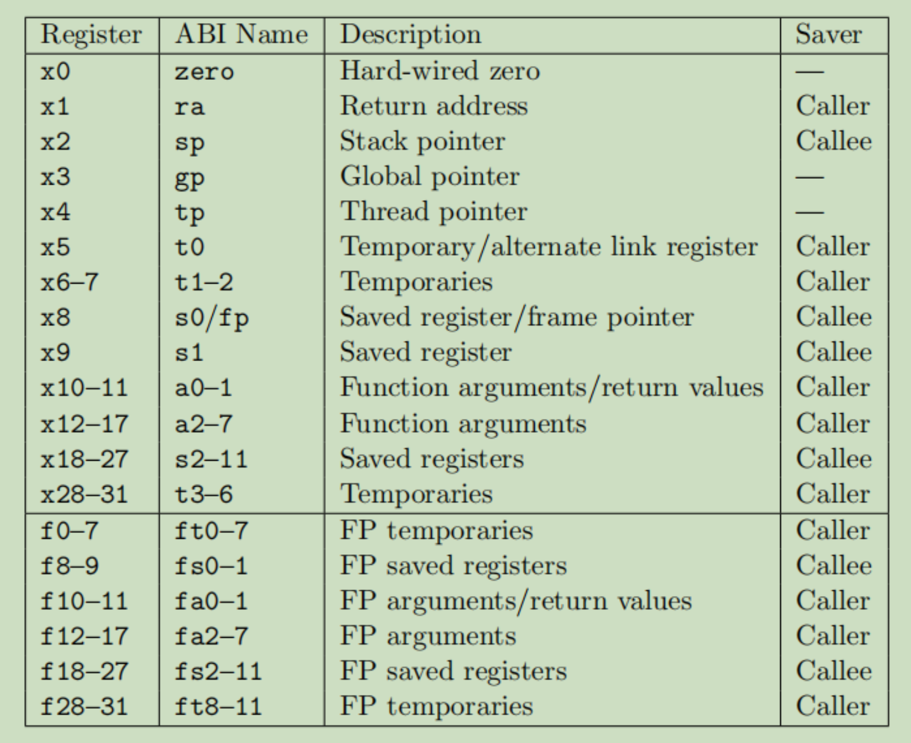

# (I)mplement (N)ote 001. VM 实现分解分析
该项目以在 VM 实现过程中学习 RISC-V 指令与构架为目标；要想实现 VM 这个大目标，首先则需要分解为小目标。

根据计算机原理可知：CPU可分为两大部分，即寄存器与指令集；而想要运行C程序等，需
要一个约定好的ABI，此时则可将目标实现任务初步分解为以下三个部分
- 寄存器
- 指令集
- ABI

其中，ABI与寄存器属于强相关联系，ABI可以说是寄存的别名约定，从规范文档可知以下别名映射关系

来源：[Volume1_riscv-spec-20191213.pdf](./pdf/Volume1_riscv-spec-20191213.pdf) `Chapter 25 RISC-V Assembly Programmer's Handbook`

而指令集比寄存器实现复杂，同时也依赖于寄存器实现，此时可得出实现步骤
1. 寄存器实现
2. 指令集实现
3. ABI实现(合并到寄存器实现别名即可)