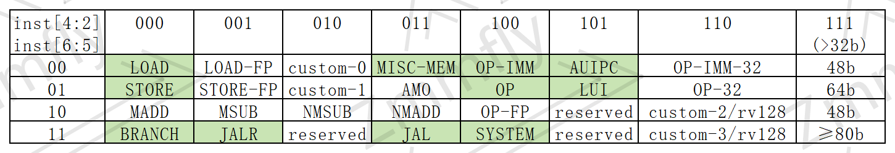

# IN003 RV接口与RV32I实现
该笔记主要记录RV接口与RV32 I指令集的实现，关于接口主要参考相关头文件

# 接口
首先实现各部分基础接口及功能定义，详情见：[rv_intf.h](../inc/zmmfly/rv_intf.h) 
其中：
- `bus_intf` 作为bus接口，用于向`bus_mgr`挂载虚拟总线设备
- `bus_mgr` 用于管理虚拟总线设备，并向指令集接口提供统一访问API
- `inst_intf` 指令集接口，仅定义基础接口，其它用于Zicsr或Zifence，或其它特殊接口均由子类定义
- `sext` 模板函数，用于RV32或RV64的立即数符号扩展

# RV32I实现
通过阅读 [Volume1_riscv-spec-20191213.pdf](./pdf/Volume1_riscv-spec-20191213.pdf) `Chapter 24` `Table 24.1` 可知RV32I opcode 分配：

其中浅绿背景色部分即为RV32I使用到的opcode，下一步实现这些opcode的相关指令即可。

根据 [Volume1_riscv-spec-20191213.pdf](./pdf/Volume1_riscv-spec-20191213.pdf) 130页的表格，
可知需要实现以下指令（二级列表首字母表示指令类型，中间为指令名称，后接C伪代码表示指令操作）：
- `LOAD`
  - `R` `LUI` `x[rd] = sext( (uint32_t)imm_31_12 << 12 )`