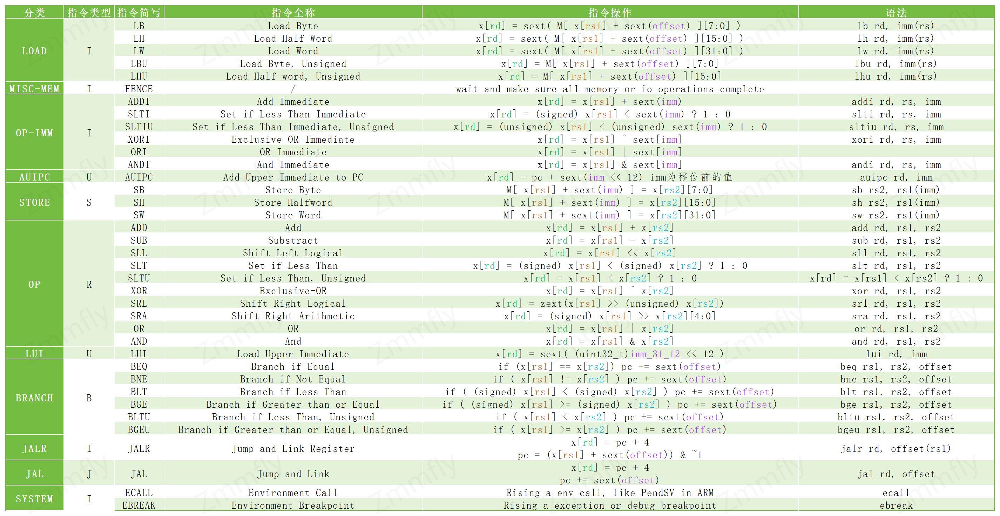

# IN003 RV接口与RV32I指令
该笔记主要记录RV接口与RV32 I指令集的实现，关于接口主要参考相关头文件

# 接口
首先实现各部分基础接口及功能定义，详情见：[rv_intf.h](../inc/zmmfly/rv_intf.h) 
其中：
- `bus_intf` 作为bus接口，用于向`bus_mgr`挂载虚拟总线设备
- `bus_mgr` 用于管理虚拟总线设备，并向指令集接口提供统一访问API
- `inst_intf` 指令集接口，仅定义基础接口，其它用于Zicsr或Zifence，或其它特殊接口均由子类定义
- `sext` 模板函数，用于RV32或RV64的立即数符号扩展

# RV32I指令
通过阅读 [Volume1_riscv-spec-20191213.pdf](./pdf/Volume1_riscv-spec-20191213.pdf) `Chapter 24` `Table 24.1` 可知RV32I opcode 分配：

其中浅绿背景色部分即为RV32I使用到的opcode，下一步实现这些opcode的相关指令即可。

根据 [Volume1_riscv-spec-20191213.pdf](./pdf/Volume1_riscv-spec-20191213.pdf) 130页的表格，
可知需要实现以下指令：
以下M表示内存

- `LOAD`
  - `I` `LB` Load Byte 
    - 动作：`x[rd] = sext( M[ x[rs1] + sext(offset) ] [7:0] )`
    - 语法：`lb rd, imm(rs)`
  - `I` `LH` Load Half word
    - 动作：`x[rd] = sext( M[ x[rs1] + sext(offset) ] [15:0] )`
    - 语法： `lh rd, imm(rs)`
  - `I` `LW` Load Word
    - 动作：`x[rd] = sext( M[ x[rs1] + sext(offset) ] [31:0] )`
      - RV32I这里已经是32位了，符号位扩展相当于无效，RV64I里这里符号位扩展则属于有效
    - 语法：`lw rd, imm(rs)`
  - `I` `LBU` Load Byte, Unsigned
    - 动作：`x[rd] = M[ x[rs1] + sext(offset) ] [7:0]`
      - 与`LB`类似，经零扩展后写入寄存器 `x[rd]`
    - 语法：`lbu rd, imm(rs)`
  - `I` `LHU` Load Half word, Unsigned
    - 动作：`x[rd] = M[ x[rs1] + sext(offset) ] [15:0]`
      - 与`LH`类似，经零扩展后写入寄存器 `x[rd]`
    - 语法：`lhu rd, imm(rs)`
- `MISC-MEM`
  - `I` `FENCE` 内存屏障
    - 该操作主要用于确保所有内存及IO操作完成，使其对其其它线程(核心)可见，大致可以视为以下几个操作
      - `cache_refresh_to_memory(); ` 缓存刷新进内存
      - `make_sure_bus_read_write_done(); ` 确保对IO总线的访问已完成
      - `cache_ensure_consistency_multicore_sync();` 确保缓存一致性，多核系统进行缓存同步
    - 可参考以下链接
      - [CPU缓存一致性：从理论到实战](https://zhuanlan.zhihu.com/p/641558949) 内存屏障部分
- `OP-IMM`
  - `I` `ADDI` Add Immediate
    - 动作：`x[rd] = x[rs1] + sext(imm_11_0)`
    - 语法：`addi rd, rs, imm`
  - `I` `SLTI` Set if Less Than Immediate
    - 动作：`x[rd] = (signed) x[rs1] < sext(imm_11_0) ? 1 : 0`
      - `x[rs1] 视为有符号数`
    - 语法：`slti rd, rs, imm`
  - `I` `SLTIU` Set if Less Than Immediate, Unsigned
    - 动作：`x[rd] = (unsigned) x[rs1] < (unsigned) sext(imm_11_0) ? 1 : 0`
      - 三元运算符， `<exp> ? <exp for true> : <exp for false>`
      - 根据RV32I规范文档所描述，如果立即数等于1，`x[rs1]` 等于0时将 `x[rd]` 置位，此时则有汇编伪代码：`SEQZ rd, rs`
    - 语法：`sltiu, rd, rs, imm`
  - `I` `XORI` Exclusive-OR Immediate
    - 动作：`x[rd] = x[rs1] ^ sext(imm_11_0)`
    - 语法：`xori rd, rs, imm`
  - `I` `ORI` OR Immediate
    - 动作：`x[rd] = x[rs1] | sext(imm_11_0)`
    - 语法：`ori rd, rs, imm`
  - `I` `ANDI` And Immediate
    - 动作：`x[rd] = x[rs1] & sext(imm_10_0)`
    - 语法：`andi rd, rs, imm`
- `AUIPC`
  - `U` `AUIPC` Add Upper Immediate to PC
    - 动作：`x[rd] = pc + sext(imm_31_12 << 12)`
    - 语法：`auipc rd, imm`
- `STORE`
  - `S` `SB` Store Byte
    - 动作：`M[ x[rs1] + sext(imm) ] = x[rs2][7:0]`
    - 语法：`sb rs2, rs1(imm)`
  - `S` `SH` Store Halfword
    - 动作：`M[ x[rs1] + sext(imm) ] = x[rs2][15:0]`
    - 语法：`sh rs2, rs1(imm)`
  - `S` `SW` Store Word
    - 动作：`M[ x[rs1] + sext(imm) ] = x[rs2][31:0]`
    - 语法：`sw rs2, rs1(imm)`
- `OP`
  - `R` `ADD` Add
    - 动作：`x[rd] = x[rs1] + x[rs2]`
    - 语法：`add rd, rs1, rs2`
  - `R` `SUB` Substract
    - 动作：`x[rd] = x[rs1] - x[rs2]`
    - 语法：`sub rd, rs1, rs2`
  - `R` `SLL` Shift Left Logical
    - 动作：`x[rd] = x[rs1] << x[rs2]`
    - 语法：`sll rd, rs1, rs2`
  - `R` `SLT` Set if Less Than
    - 动作：`x[rd] = (signed) x[rs1] < (signed) x[rs2] ? 1 : 0`
    - 语法：`slt rd, rs1, rs2`
  - `R` `SLTU` Set if Less Than, Unsigned
    - 动作：`x[rd] = x[rs1] < x[rs2] ? 1 : 0`
    - 语法：`sltu rd, rs1, rs2`
  - `R` `XOR` Exclusive-OR
    - 动作：`x[rd] = x[rs1] ^ x[rs2]`
    - 语法：`xor rd, rs1, rs2`
  - `R` `SRL` Shift Right Logical
    - 动作：`x[rd] = zext(x[rs1] >> (unsigned) x[rs2])`
      - zext：0扩展
    - 语法：`srl rd, rs1, rs2`
  - `R` `SRA` Shift Right Arithmetic
    - 动作：`x[rd] = (signed) x[rs1] >> x[rs2][4:0] `
      - 算术右移，空位用`x[rs1]`的最高位填充，即保持符号一致
      - `x[rs2]`的低5位表示移动位数，高位被忽略
    - 语法：`sra rd, rs1, rs2`
  - `R` `OR` OR
    - 动作：`x[rd] = x[rs1] | x[rs2]`
    - 语法：`or rd, rs1, rs2`
  - `R` `AND` And
    - 动作：`x[rd] = x[rs1] & x[rs2]`
    - 语法：`and rd, rs1, rs2`
- `LUI`
  - `R` `LUI` Load Upper immediate
    - 动作：`x[rd] = sext( (uint32_t)imm_31_12 << 12 )`
    - 语法：`lui rd, immediate`
- `BRANCH`
  - `B` `BEQ` Branch if Equal
    - 动作：`if (x[rs1] == x[rs2]) pc += sext(offset)`
    - 语法：`beq rs1, rs2, offset`
  - `B` `BNE` Branch if Not Equal
    - 动作：`if ( x[rs1] != x[rs2] ) pc += sext(offset)`
    - 语法：`bne rs1, rs2, offset`
  - `B` `BLT` Branch if Less Than
    - 动作：`if ( (signed) x[rs1] < (signed) x[rs2] ) pc += sext(offset)`
    - 语法：`blt rs1, rs2, offset`
  - `B` `BGE` Branch if Greater Than or Equal
    - 动作：`if ( (signed) x[rs1] >= (signed) x[rs2] ) pc += sext(offset)`
    - 语法：`bge rs1, rs2, offset`
  - `B` `BLTU`  Branch if Less Than, Unsigned
    - 动作：`if ( x[rs1] < x[rs2] ) pc += sext(offset)`
    - 语法：`bltu rs1, rs2, offset`
  - `B` `BGEU` Branch if Greater Than or Equal, Unsigned
    - 动作：`if ( x[rs1] >= x[rs2] ) pc += sext(offset)`
    - 语法：`bgeu rs1, rs2, offset`
- `JALR`
  - `I` `JALR` Jump and Link Register
    - 动作：
      1. `x[rd] = pc + 4;`
      2. `pc = (x[rs1] + sext(offset)) & ~1`
    - 语法：`jalr rd, offset(rs1)`
- `JAL`
  - `J` `JAL` Jump and Link
    - 动作：
      1. `x[rd] = pc + 4`
      2. `pc += sext(offset)`
    - 语法： `jal rd, offset` 
- `SYSTEM`
  - `I` `ECALL` Environment Call
    - 动作：`Rising a env call, like PendSV in ARM`
    - 语法：`ecall`
  - `I` `EBREAK` Environment Breakpoint
    - 动作：`Rising a exception or debug breakpoint`
    - 语法：`ebreak`

# 清单

# 小结
1. 早期RISC-V spec中，`csrrc`、`csrrs`、`csrrw` 等CSR相关指令均归于RV32I中，这样对于部分不需要CSR相关功能的场景可能带来额外面积消耗，最新的 spec 中，CSR相关操作均归于 `Zicsr` 扩展中，以便于定制
2. 对于以虚拟机形式实现RISC-V指令集的解析与执行，对于部分需要交互的指令集，需要设计一个较为通行的指令集接口，便于指令集间通信
