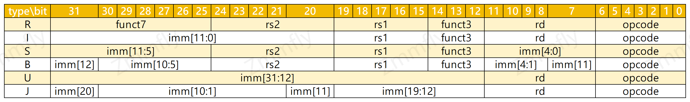

# IN004 RV32I中分散的立即数
在实现RV32I指令集的过程中，部分如下列表所示指令类型携带立即数；
这部分里面，有的立即数在指令中是分散开的，这给实现工作带来一部分小麻烦，对于分散的立即数需要重新组装起来

如上，`S`、`B`、`J` 这三个类型指令的立即数都不像`I`类型指令一样为连续的比特位

**那么，为什么要这样做呢？**

思考下，如果立即数比特按顺序排列，指令需要改成什么样？

以及，从软件解析出发，修改会带来什么样的影响？

如果从 软件解析指令，这个作为起点，当然是希望立即数能排列的整整齐齐的，而不是分散开的；

但是，从硬件层面出发，必然是以 简单、可靠、高复用 为基点，毕竟 RISC-V 是CPU指令集，而不是虚拟机指令集，这里用 C++ 去模拟也仅仅只是为了学习。

仔细观察下上面的指令类型表，可以很直观的发现：

1. `R`、`S`、`B` 的 `rs2` 都位于 `[24:20]` 这个比特范围内
2. `R`、`I`、`S`、`B` 的 `rs1` 与 `funct3` 都分别位于 `[19:15]` / `[14:12]` 这两个范围内
3. `R`、`I`、`U`、`J` 的 `rd` 均位于 `[11:7]` 这个范围内

还有没有？当然有，但是需要更仔细一些（其实也就是找更多的相同点）：

1. `I`、`S` 的 `imm[11:5]` 均位于 `[31:25]`
2. `S`、`B` 的 `imm[4:1]` 均位于 `[11:8]`
3. `I`、`S`、`B`、`J` 的 `imm[10:5]` 均位于 `[30:25]`
4. `I`、`J` 的 `imm[10:1]` 均位于 `[30:21]` 

结合以上信息，在硬件层面，用多路选择器，即可选出立即数；而不用像模拟器一般进行移位拼接。

如下图，即通过选择器获取立即数的`bit11`，以及直通获取`bit5`

**参考**
- 多路选择器图片来源：[请问RiscV的那种将立即数分散，寄存器编码位置固定，比起传统的cpu，如mips等，有何优缺点？](https://www.zhihu.com/question/405003253)
