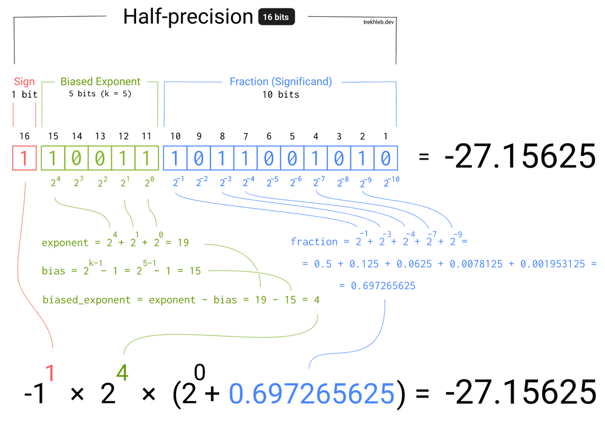

# # RISC-V F 扩展，浮点指令实现

**R4指令类型**
基于R指令类型进行了部分修改，结构如下：

| 比特范围| 31 ~ 27 | 26 ~ 25 | 24 ~ 20 | 19 ~ 15 | 14 ~ 12 | 11 ~ 7 | 6 ~ 0  |
| :-:| :-:| :-:| :-:| :-:| :-:| :-:| :-:|
|   释义  |   src3  |   fmt   |   src2  |   src1  |   rm    |    dst | opcode |
|   位宽  |    5    |    2    |    5    |    5    |    3    |    5   |   7    |

## 指令清单
| 指令 | 类型 | OPCODE | func3 | func7 | 备注 |
| :-:  | :-: |   :-:  | :-: | :-: | :-: |
| flw  |  I  | 00'001'11| NONE | NONE | NONE |
| fsw  |  S  | 01'001'11 | NONE | NONE | NONE |
| fmadd.s | R4 | 10'000'11 | NONE | NONE | NONE |
| fmsub.s | R4 | 10'001'11 | NONE | NONE | NONE |
| fnmsub.s | R4 | 10'010'11 | NONE | NONE | NONE |
| fnmadd.s | R4 | 10'011'11 | NONE | NONE | NONE |
| fadd.s | R | 10'100'11 | NONE | 000'0000 | NONE |
| fsub.s | R | 10'100'11 | NONE | 000'0100 | NONE |
| fmul.s | R | 10'100'11 | NONE | 000'1000 | NONE |
| fdiv.s | R | 10'100'11 | NONE | 000'1100 | NONE |
| fsqrt.s| R | 10'100'11 | NONE | 010'1100 `(1)` | NONE |
| fsgnj.s| R | 10'100'11 | 000 | 001'0000 | NONE |
| fsgnjn.s | R | 10'100'11 | 001 | 001'0000 | NONE |
| fsgnjx.s | R | 10'100'11 | 010 | 001'0000 | NONE |
| fmin.s | R | 10'100'11 | 000 | 001'0100 | NONE |
| fmax.s | R | 10'100'11 | 001 | 001'0100 | NONE
| fcvt.w.s | R | 10'100'11 | NONE | 110'0000 | rs2 = 00000 |
| fcvt.wu.s | R | 10'100'11 | NONE | 110'0000 | rs2 = 00001 |
| fmv.x.w | R | 10'100'11 | 000 | 111'0000 | rs2 = 00000 |
| feq.s | R | 10'100'11 | 010 | 101'0000 | NONE |
| flt.s | R | 10'100'11 | 001 | 101'0000 | NONE |
| fle.s | R | 10'100'11 | 000 | 101'0000 | NONE |
| fclass.s | R | 10'100'11 | 001 | 111'0000 | NONE |
| fcvt.s.w | R | 10'100'11 | NONE | 110'1000 | rs2 = 00000 |
| fcvt.s.wu | R | 10'100'11 | NONE | 110'1000 | rs2 = 00001 |
| fmv.w.x | R | 10'100'11 | 000 | 111'1000 | rs2 = 00000 |

**附注**
- `(1)`: `参考1` 指令清单中，`fsqrt.s` 与 `fsqrt.s` 标注一致，查阅 `参考2` 应为 `010'1100`

## 指令行为：
1. `flw`
   - `f32[rd] = M[ x[rs1] + sext(imm) ] [31:0]`
2. `fsw`
   - `M[ x[rs1] + sext(imm) ] = f32[rs2] [31:0]`
3. `fmadd.s`
   - `f32[rd] = f32[rs1] x f32[rs2] + f32[rs3]`
4. `fmsub.s`
   - `f32[rd] = f32[rs1] x f32[rs2] - f32[rs3]`
5. `fnmsub.s`
   - `f32[rd] = -(f32[rs1] x f32[rs2]) + f32[rs3]`
6. `fnmadd.s`
   - `f32[rd] = -(f32[rs1] x f32[rs2]) - f32[rs3]`
7. fadd.s
   - `f32[rd] = f32[rs1] + f32[rs2]`
8. fsub.s
   - `f32[rd] = f32[rs1] - f32[rs2]`
9.  fmul.s
   - `f32[rd] = f32[rs1] x f32[rs2]`
10. fdiv.s
   - `f32[rd] = f32[rs1] / f32[rs2]`
11. fsqrt.s
   - `f32[rd] = sqrt(f32[rs1])`
12. fsgnj.s
   - `f32[rd] = { f32[rs2][31], f32[rs1][31:0] }`
13. fsgnjn.s
   - `f32[rd] = { ~f32[rs2][31], f32[rs1][31:0] }`
14. fsgnjx.s
   - `f32[rd] = { f32[rs1][31] ^ f32[rs2][31], f32[rs1][31:0] }`
15. fmin.s
   - `f32[rd] = min(f32[rs1], f32[rs2])`
16. fmax.s
   - `f32[rd] = max(f32[rs1], f32[rs2])`
17. fcvt.w.s
   - `x[rd] = sext( (signed 32) f32[rs1] )`
18. fcvt.wu.s
   - `x[rd] = sext( (unsigned 32) f32[rs1] )`
19. fmv.x.w
   - `x[rd] = sext( f32[rs1][31:0] )`
20. feq.s
   - `x[rd] = f32[rs1] == f[rs2] ? 1 : 0`
21. flt.s
   - `x[rd] = f32[rs1] < f[rs2] ? 1 : 0`
22. fle.s
   - `x[rd] = f32[rs1] <= f[rs2] ? 1 : 0`
23. fclass.s
   - `x[rd] = classify(f32[rs1])`, 对`f32[rs1]`进行分类，`x[rd]`有且仅有一位被置位，比特位置位时的含义如下：
     - 0 `f32[rs1]` 为 负无穷
     - 1 `f32[rs1]` 为 负规格数(negative normal number)
     - 2 `f32[rs1]` 为 负次规格数(negative subnormal nnumber)
     - 3 `f32[rs1]` 为 -0
     - 4 `f32[rs1]` 为 +0
     - 5 `f32[rs1]` 为 正次规格数(positive subnormal number)
     - 6 `f32[rs1]` 为 正规格数(postive normal number)
     - 7 `f32[rs1]` 为 正无穷
     - 8 `f32[rs1]` 为 信号(signaling) NaN
     - 9 `f32[rs1]` 为 静默(quit) NaN
24. fcvt.s.w
   - `f[rd] = (f32) ((s32) x[rs1])`
25. fcvt.s.wu
   - `f[rd] = (f32) ((u32) x[rs1])`
26. fmv.w.x
   - `f32[rd] = x[rs1][31:0]`

## IEEE754
修订版本: 2008

**数据结构**

|  type   |     sign    |   exponent  |   faction   |
|:-------:|:-----------:|:-----------:|:-----------:|
| fp16    | 1b`[15:15]` | 5b`[14:10]` | 10b`[9:0]`  |
| float   | 1b`[31:31]` | 8b`[30:23]` | 23b`[22:0]` |
| double  | 1b`[63:63]` | 11b`[62:52]`| 52b`[51:0]` |

**计算过程**
1. 借用[trekhleb](https://github.com/trekhleb)的图, 半精度, 规格化:

2. 非规格化参考: 参考6

## 参考
1. 指令清单: [RISC-V-Reader-Chinese-v2p1.pdf](./pdf/RISC-V-Reader-Chinese-v2p1.pdf) PDF第59页，电子书57页
2. R4指令类型: [Volume1_riscv-spec-20191213.pdf](./pdf/Volume1_riscv-spec-20191213.pdf) PDF第69页
3. https://www.binaryconvert.com/convert_double.html
4. https://www.h-schmidt.net/FloatConverter/IEEE754.html
5. https://www.toolhelper.cn/Digit/FractionConvert
6. https://upimg.baike.so.com/doc/643382-681042.html